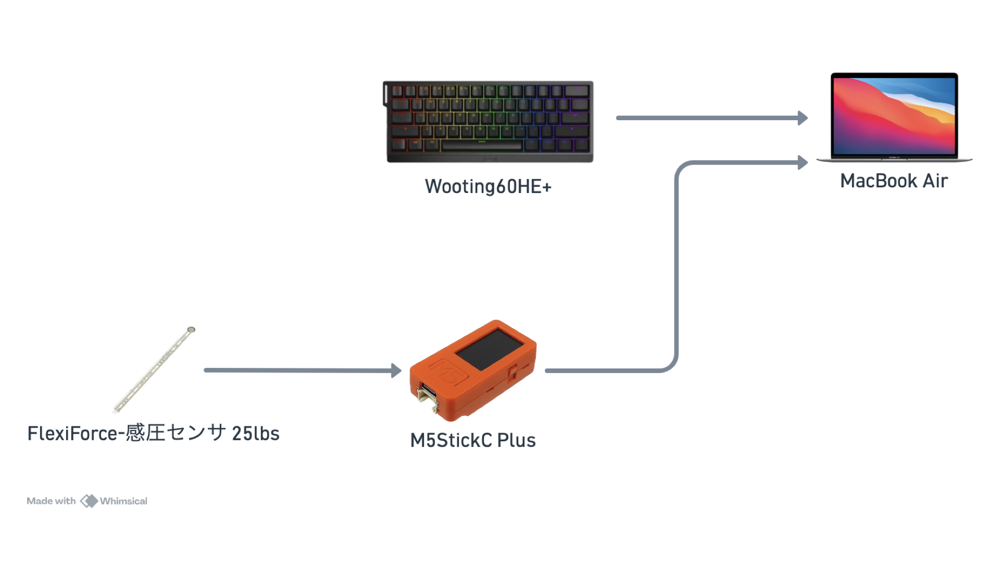
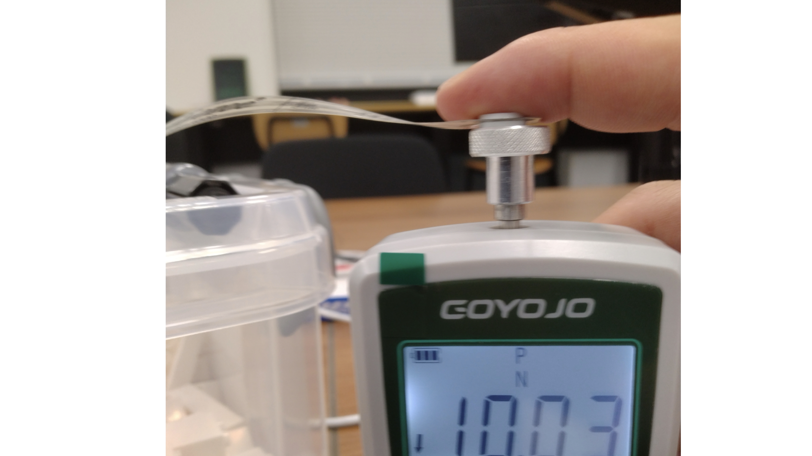
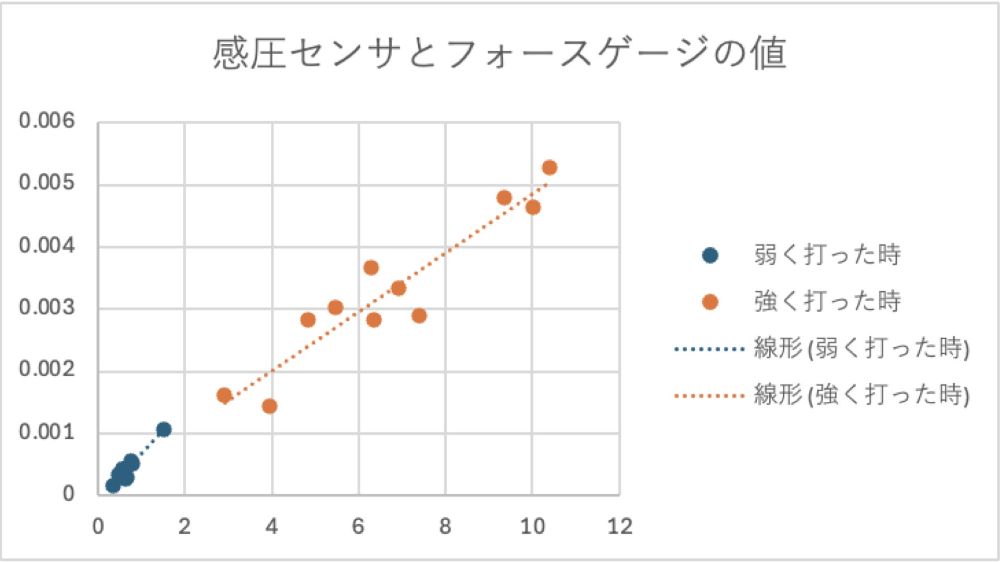
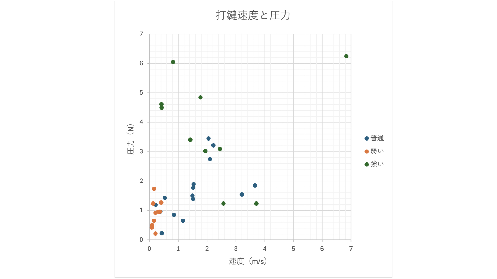
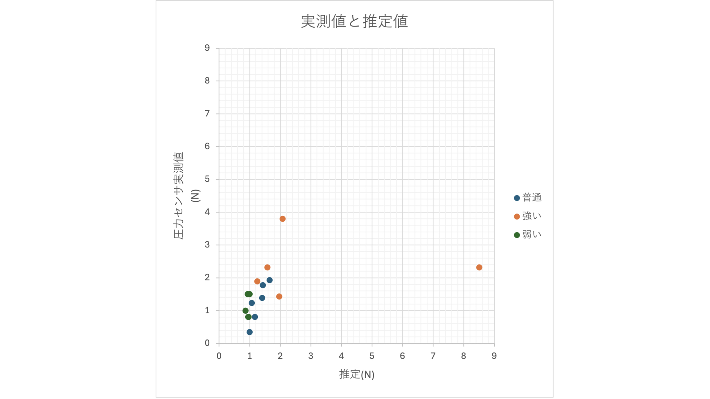

::: jkeyword
タイピング，ゲーム，打鍵圧，アナログキーボード，センシング，
:::

yokota syunsukeAIT\[x23099xx@aitech.ac.jp\]

oguri shinyaAIT\[shinyaoguri@aitech.ac.jp\]

# はじめに

近年，在宅勤務やAIの普及によって，テキストを用いたコミュニケーションの重要性が増している．
総務省の統計によれば，テレワークを導入する企業の割合は，令和元年の20.1%から令和7年には50.1%へと増加した[@soumu_tsushin_r1; @soumu_tsushin_r7]．

一般に，コミュニケーションでは言語以外にも様々な情報がやり取りされる．
たとえば手紙のように手書き文字を用いる方法では，筆圧や字の丁寧さといった非言語的な情報が筆跡に豊富に含まれ，書き手の個性や状況，感情などを読み取ることができる[@tegaki]．
これらは言語情報を補足し，豊かな表現を可能にすると考えられている．

しかし，一般的なキーボードを用いたテキストコミュニケーションでは，こうした非言語的な情報を伝えることが難しい．
メンブレン式やメカニカル式に代表されるキーボードは，キーの押下状態をオン・オフの二値で表現するため，打鍵そのものの速度や力を取得できないためである．

一方，近年普及しつつあるアナログキーボードは，キーごとの押し込み量を連続値として取得できる．
本研究では，この特性を利用して打鍵の強さ（以下，打鍵圧）を推定する手法を提案し，それを応用したタイピングゲームを開発する．
具体的には，市販のアナログキーボードから取得できるキー押下速度を入力とし，感圧センサによる実測値をもとに構築した回帰モデルによって打鍵圧を推定する．
さらに，推定した打鍵圧のコントロールを競うタイピングゲームを設計・実装し，従来の二値的なキー入力にはない操作の自由度を活かした体験を提示する．

本研究の主な貢献は以下の通りである．

- 市販のアナログ（磁気式）キーボードのキー押下速度から打鍵圧を推定する手法を示し，専用の圧力センサを常時装着することなく，Webアプリのみで打鍵圧を扱えることを示した．

- 感圧センサによる実測値を用いて速度と打鍵圧の関係をモデル化し，その推定精度と限界を定量的に検証した．

- 推定した打鍵圧のコントロールを競う新しいタイピングゲームを設計・実装し，非言語的入力を活かしたエンタテインメントの可能性を示した．

# 先行研究

キーボード入力における打鍵圧を非言語的な入力として扱う研究がいくつか存在する．
Expressive
Typing[@ExpressiveTyping]は，手書き文字の筆跡に対応するものとしてキーを押す力（打鍵圧）に着目し，HDDを内蔵するPCに付随する加速度センサからその値を求めていた．
また，A practical pressure sensitive computer
keyboard[@A_practical_pressure_sensitive_computer_keyboard]は，圧力を検知できるメンブレン方式のキーボードを新たに開発している．

本研究との差異は次の点にある．
前者は打鍵時の指の速度を打鍵圧の代理指標として扱う点で本研究と方針が近いが，HDDの保護用に加速度センサを内蔵したPCを前提とする．
後者は打鍵圧を直接計測するために専用のキーボードを開発する必要がある．
これに対し本研究は，市販されているアナログキーボードから取得できるキー押下速度のみを用い，追加のハードウェアなしにWebアプリ上で打鍵圧を推定する点に特徴がある．
なお本稿におけるキー押下速度とは，あるキーから次のキーを押すまでの間隔ではなく，単一のキーが押し込まれる速度を指す．

# 打鍵圧推定手法

<figure id="fig:hardware" data-latex-placement="tb">

<figcaption>ハードウェア構成図</figcaption>
</figure>

アナログキーボードは，キーの押し込み量を連続的に取得できるキーボードである．
本研究で用いるWooting60HE+は，キー内部に磁石とホールセンサを備え，両者の距離から押し込み量を算出する．
本手法のハードウェア構成を図[1](#fig:hardware){reference-type="ref"
reference="fig:hardware"}に示す．

## 打鍵圧の定義

本研究では，計測する打鍵圧を「キーが底をついた瞬間の衝撃力」と定義する．
キーを押し込んだ後に力を加えるパターンも考えられるが，本研究では対象としない．
キーを速く押し込むほど底打ち時の運動量が大きくなり，より大きな衝撃力が生じると考えられる．
そこで本研究では，キー押下速度を打鍵圧の代理指標として用い，感圧センサによる実測値との対応づけを行う．

## 計測システム

打鍵圧とキー押下速度を対応づけるため，両者を同時に取得できるシステムを構築した．
システムは，打鍵時のキー速度を押し始めと押し終わりの2点間の時間と距離から算出し，圧力については計測された最大値を打鍵圧としてコンソールに表示する．

感圧センサの値は，M5StickC Plusからのシリアル通信をArduino
IDEを用いて表示する． 最大値はM5StickC
Plus側で処理し，シリアルモニタの数値を読むだけで完結する簡潔な仕組みとした．

キー押下速度は，WebHID
APIを用いてHID通信を受け取るシステムを開発して取得した．
このシステムはAnalogsense.jsライブラリを用いて生の値を0から1に正規化し，同時にPerformance.now()によってタイムスタンプを付加する．
得られたキーの深さとタイムスタンプを，あらかじめ用意したストローク長と組み合わせて速度を算出する．
Performance.now()の値は通常100 $\mu$sまで丸められるため[@performanceNow]，COOP・COEPヘッダを付与することで5 $\mu$sの精度を確保した．

感圧センサのADCのデータレートは128 SPS，分解能は16 bitであり，アナログキーボードのポーリングレートは1000 Hz，分解能は8 bitである．

## 感圧センサのキャリブレーション

<figure id="fig:calib" data-latex-placement="htbp">

<figcaption>フォースゲージを用いたキャリブレーションの様子</figcaption>
</figure>

<figure id="fig:pressureAndForceGage" data-latex-placement="tb">

<figcaption>感圧センサとフォースゲージの値</figcaption>
</figure>

感圧センサはフォースゲージを用いてキャリブレーションした．
キャリブレーションの様子を図[2](#fig:calib){reference-type="ref"
reference="fig:calib"}に示す．
フォースゲージの感圧部に感圧センサを載せ，強く叩く場合と弱く叩く場合の2種類で，人差し指による打鍵圧をそれぞれ11回計測した．
その際の散布図を図[3](#fig:pressureAndForceGage){reference-type="ref"
reference="fig:pressureAndForceGage"}に示す．
フォースゲージと感圧センサの値の相関係数は，小数第4位を四捨五入して0.984であった．

## キー押下速度と打鍵圧の相関

キャリブレーションした感圧センサを用いて，打鍵圧とキー押下速度の相関を調べた．
感圧センサをアナログキーボードのキー表面に設置し，打鍵と同時に圧力を取得できるようにした．
この状態で，人差し指がキーを押す力を強い・普通・弱いの3段階に分け，それぞれ10回ずつ計測した．

実験の結果，強い打鍵では値のばらつきが大きかったものの，全体として緩やかな相関が認められた．
感圧センサによる打鍵圧の実測値とキー押下速度の関係を図[4](#fig:pressureVsVelocity){reference-type="ref"
reference="fig:pressureVsVelocity"}に示す．
相関係数は全体で0.561，普通と弱い打鍵に限ると0.642であった．

<figure id="fig:pressureVsVelocity" data-latex-placement="tb">

<figcaption>打鍵圧の実測値とキー押下速度の関係</figcaption>
</figure>

# 推定モデルとその評価

打鍵圧とキー押下速度の間に線形の相関が確認できたため，一次関数によるモデルを構成した．
前節で計測した値をもとに最小二乗法で回帰式を求め，これを推定モデルとした．

評価のために，弱い・普通・強い打鍵を人差し指でそれぞれ5回ずつ行い，提案モデルを通した推定値と感圧センサによる実測値を比較した．
評価時の散布図を図[5](#fig:estimateVSReal){reference-type="ref"
reference="fig:estimateVSReal"}に示す．

<figure id="fig:estimateVSReal" data-latex-placement="tb">

<figcaption>推定モデルによる推定値と実測値</figcaption>
</figure>

実験の結果，実測値と推定値の間に弱い相関が認められた．
外れ値を含めた相関係数は0.390，強い打鍵の試行で生じた1件の外れ値を除いた相関係数は0.746であった．
ただし，試行数が$n=15$と少なく，1件の外れ値によって相関係数が大きく変動する点には注意が必要である．
外れ値の除外は[6](#sec:discussion){reference-type="ref"
reference="sec:discussion"}節で述べる物理的要因にもとづく参考値であり，推定精度は今後より多くの試行で再評価する必要がある．
なお，後述するゲームでは推定値を強・普通・弱の3段階に量子化して用いるため，連続値の相関係数に加えて，3段階分類の正解率による評価が実態に即すると考えられる．

# ゲームへの応用

本研究で提案するモデルを用いて，タイピングゲームを開発した．

## 設計方針

ゲームの設計にあたっては，基本となるタスクの正確さに加えて「表現の巧拙」を採点するエンタテインメントの構造を参考にした．
たとえばカラオケの採点は，正しい音程で歌うという基本性能に加えて，ビブラートやこぶしといった要所での表現技術を評価する．
歌い手はただ歌詞をなぞるのではなく，要所で表現を作り込むことで高得点を狙う．
本研究のタイピングゲームでも，文字を正確に入力するという基本タスクに加えて，要所での打鍵圧のコントロールという表現を採点対象とすることを目指した．
一般的なタイピングゲームが速度と正確さのみを競うのに対し，打鍵圧という表現の次元を加える点が本ゲームの特徴である．

この方針のもとで，打鍵圧を用いたタイピングゲームに必要な要素を検討した．
一つ目に，タイピングゲームである以上，タイピングの速さに対する報酬を十分に用意する必要がある．
二つ目に，「できるだけ強く打つ」あるいは「できるだけ弱く打つ」ことだけを目的とするゲームになるべきではない．
そこで打鍵圧を常時指定するのではなく，カラオケのしゃくりやビブラートのように要所で試す形式とした．
タイピング速度に報酬を与えつつ常時打鍵圧を指定すると，ゲームがうまく成立しない恐れがあったためである．

## ゲームプレイ

プレイヤは，画面に表示される文字を，打鍵圧を指定するマークの指示に従って入力する．
文をタイプし終えるごとに100 ptが与えられ，さらに打鍵圧の指定をクリアするごとに50 ptが加点される．
2分間プレイした合計点を競う．

ゲーム画面を図[6](#fig:game){reference-type="ref"
reference="fig:game"}に示す．
ゲーム画面には，現在入力中の文と次の5文が表示される．
また，打鍵圧に応じた視覚的フィードバックの例として，強く打鍵した場合を図[7](#fig:strong){reference-type="ref"
reference="fig:strong"}に，弱く打鍵した場合を図[8](#fig:weak){reference-type="ref"
reference="fig:weak"}に示す．

打鍵圧を指定するマークは2種類制作した．
アイコンの表示例を図[9](#fig:icon){reference-type="ref"
reference="fig:icon"}に示す．
1つ目の「強く」は赤色の上向き三角形で，アイコンが表示されたひらがなを強く打鍵する指定である．
2つ目の「弱く」は青色の下向き三角形で，アイコンが表示されたひらがなを弱く打鍵する指定である．

一般的でない操作方法をゲームに用いる際は，操作結果のフィードバックが必須であると考えた．
そこで入力中に，打鍵圧に応じて「ワ」「ウ」と声のような音が出るよう，Tone.jsを用いてフォルマント合成を実装した．
これにより，画面を見たままでもユーザは打鍵圧のフィードバックを聴覚的に受け取ることができる．

## 制作

<figure id="fig:game" data-latex-placement="tb">

<figcaption>ゲーム画面</figcaption>
</figure>

<figure id="fig:strong" data-latex-placement="tb">

<figcaption>強く打った時の図</figcaption>
</figure>

<figure id="fig:weak" data-latex-placement="tb">

<figcaption>弱く打った時の図</figcaption>
</figure>

<figure id="fig:icon" data-latex-placement="tb">

<figcaption>2種類のアイコン</figcaption>
</figure>

### 判定ロジック

打鍵圧の推定値を1〜2 Nの範囲でクランプして0〜1に正規化し，「強」「普通」「弱」の3段階に量子化した．
この量子化した打鍵圧を用いて，以下のロジックで加点判定を行う．

- 「強く」アイコンが指定された文字では，子音・母音いずれの打鍵も「弱」と判定されなければクリアとし，50 ptを加点する．

- 「弱く」アイコンが指定された文字では，子音・母音いずれの打鍵も「強」と判定されなければクリアとし，50 ptを加点する．

### 実装

ゲームの制作はTypeScriptを用い，Viteの開発環境下で行った．
打鍵圧の推定エンジンは，モデル構築に用いたものをモジュール化してそのまま利用した．
セキュリティヘッダには計測システムと同様にCOOP・COEPヘッダを付与し，Performance.now()の精度を確保した．
データはGitHubで管理し，制作したゲームはVercelを用いてデプロイした．

## 成果

打鍵圧の指定を必須とせず，クリアした際の加点要素とすることで，タイピングの手を止めずに快適なゲーム体験を実現できた．
一方で改善点として，打鍵圧指定の種類の少なさや，スコアのみに頼らないゲーム性の構築が挙げられる．
また，実際のプレイヤによる定量的な評価は今後の課題である．

# 考察 {#sec:discussion}

## 推定精度とゲーム性の関係

本手法の打鍵圧推定は，特に強い打鍵において精度が十分とは言えない．
それにもかかわらず，開発したゲームが破綻せず快適にプレイできたのは，ゲーム側で推定値を強・普通・弱の3段階に量子化して扱い，かつ打鍵圧の指定を必須ではなく加点要素としたためと考えられる．
すなわち，連続値としての推定誤差が大きくても，段階的な判定と寛容なスコアリングによって誤差の影響を吸収できていた．
このことは，打鍵圧のような不確実な非言語的入力をエンタテインメントに応用する際の設計指針として有用である．

## 強い打鍵における推定誤差の要因

強い打鍵で打鍵圧をうまく取得できない要因として，以下が考えられる．
キーボード側では，強い打鍵ほどキーが底をつくまでの区間が短くなり，押し込み速度の計測誤差が生じやすい．
実測値側では，感圧センサ自体のノイズや，高荷重域での応答の非線形性・飽和特性がある．
さらに，フォースゲージによるキャリブレーション時と実際の打鍵時とで，感圧センサに加わる押し込み方向や接触位置がずれることによる測定誤差も考えられる．
今後はこれらの要因を切り分けて検証し，強い打鍵でも安定して打鍵圧を推定できるよう，モデルと検証方法を再検討する必要がある．

# まとめ

本研究では，アナログキーボードの入力から線形モデルを用いて打鍵圧を推定する手法を提案し，その応用として打鍵圧を用いたタイピングゲームを開発した．
打鍵圧の推定には強い打鍵での精度に課題が残るものの，段階的な判定と加点方式の設計により，非言語的入力を活かしたゲーム体験を実現できた．

今後の展望として，コミュニケーションツールやAIプラットフォームへの応用が期待される．
キーボード入力時の非言語的情報として打鍵圧を取得できれば，たとえばAIにプロンプトを入力する際に，強く打鍵していれば焦っている，弱ければ迷っている，といったユーザの状態推定に活用できる可能性がある．
実際，FEELing(key)Pressed[@FEELingPressed]では，ゲームプレイヤのストレスレベルを打鍵圧から非侵襲的に計測している．

::: acknowledgment
本研究の一部はJSPS科研費JP23K17024の助成を受けたものです．
:::

::: biography
:::
